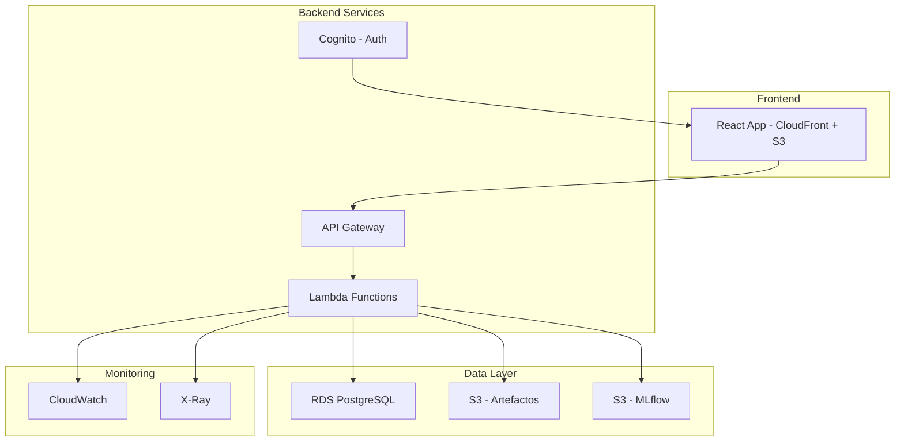

# ModelGov - Guía de Despliegue y Personalización en AWS

## 📋 Tabla de Contenido

1. [Descripción General](#descripción-general)
2. [Arquitectura en AWS](#arquitectura-en-aws)
3. [Despliegue en Producción](#despliegue-en-producción)
4. [Personalización del Código](#personalización-del-código)
5. [Configuración de Listas Desplegables](#configuración-de-listas-desplegables)
6. [Gestión de Usuarios y Roles](#gestión-de-usuarios-y-roles)
7. [Integración con MLflow y S3](#integración-con-mlflow-y-s3)
8. [Monitoreo y Operación](#monitoreo-y-operación)
9. [Seguridad y Mejores Prácticas](#seguridad-y-mejores-prácticas)

---

## 🎯 Descripción General

ModelGov es una plataforma de gobierno de modelos de Machine Learning e IA Generativa que permite:

- **Registro de Modelos**: Captura de metadatos, métricas, artefactos y trazabilidad
- **Informes y Analytics**: Dashboards para análisis de riesgo y salud de modelos
- **Seguimiento**: Monitoreo de performance y necesidades de recalibración
- **Experimentos**: Integración con MLflow para gestión de experimentos
- **Control de Acceso**: Sistema de roles (Admin, Editor, Visualizador)

---

## 🏗️ Arquitectura en AWS

### Componentes Principales



### Servicios AWS Requeridos

- **Amazon S3**: Almacenamiento de artefactos, modelos, gráficos
- **Amazon CloudFront**: CDN para el frontend
- **AWS Lambda**: APIs serverless para backend
- **Amazon API Gateway**: Gestión de APIs REST
- **Amazon RDS (PostgreSQL)**: Base de datos principal
- **Amazon Cognito**: Autenticación y autorización
- **AWS CloudWatch**: Monitoreo y logs
- **AWS X-Ray**: Trazabilidad de requests

---

## 🚀 Despliegue en Producción

### Paso 1: Preparación del Código

```bash
# Clonar el repositorio
git clone <repository-url>
cd modelgov

# Instalar dependencias
npm install

# Build para producción
npm run build
```

### Paso 2: Configuración de Infrastructure as Code (CDK/CloudFormation)

Crear `infrastructure/main.ts`:

```typescript
import * as cdk from 'aws-cdk-lib';
import * as s3 from 'aws-cdk-lib/aws-s3';
import * as cloudfront from 'aws-cdk-lib/aws-cloudfront';
import * as rds from 'aws-cdk-lib/aws-rds';
import * as cognito from 'aws-cdk-lib/aws-cognito';

export class ModelGovStack extends cdk.Stack {
  constructor(scope: Construct, id: string, props?: cdk.StackProps) {
    super(scope, id, props);

    // S3 bucket para frontend
    const websiteBucket = new s3.Bucket(this, 'ModelGovWebsite', {
      bucketName: 'modelgov-frontend-prod',
      websiteIndexDocument: 'index.html',
      publicReadAccess: true,
    });

    // CloudFront distribution
    const distribution = new cloudfront.CloudFrontWebDistribution(this, 'ModelGovCDN', {
      originConfigs: [{
        s3OriginSource: {
          s3BucketSource: websiteBucket
        },
        behaviors: [{ isDefaultBehavior: true }]
      }]
    });

    // RDS PostgreSQL
    const database = new rds.DatabaseInstance(this, 'ModelGovDB', {
      engine: rds.DatabaseInstanceEngine.postgres({
        version: rds.PostgresEngineVersion.VER_14
      }),
      instanceType: ec2.InstanceType.of(ec2.InstanceClass.T3, ec2.InstanceSize.MICRO),
      credentials: rds.Credentials.fromGeneratedSecret('modelgov-admin'),
      multiAz: true,
      deletionProtection: true,
    });

    // Cognito User Pool
    const userPool = new cognito.UserPool(this, 'ModelGovUsers', {
      userPoolName: 'modelgov-users',
      selfSignUpEnabled: false,
      signInAliases: {
        email: true,
        username: true
      },
      passwordPolicy: {
        minLength: 8,
        requireLowercase: true,
        requireUppercase: true,
        requireDigits: true,
        requireSymbols: true,
      },
    });
  }
}
```

### Paso 3: Deploy Scripts

Crear `scripts/deploy.sh`:

```bash
#!/bin/bash

# Variables
AWS_REGION="us-east-1"
STACK_NAME="modelgov-prod"
S3_BUCKET="modelgov-frontend-prod"

echo "🚀 Iniciando despliegue de ModelGov..."

# 1. Build del frontend
echo "📦 Building frontend..."
npm run build

# 2. Deploy infrastructure
echo "🏗️ Deploying infrastructure..."
cdk deploy $STACK_NAME --region $AWS_REGION

# 3. Upload frontend a S3
echo "⬆️ Uploading frontend to S3..."
aws s3 sync dist/ s3://$S3_BUCKET --delete

# 4. Invalidar CloudFront cache
echo "🗑️ Invalidating CloudFront cache..."
DISTRIBUTION_ID=$(aws cloudfront list-distributions --query "DistributionList.Items[?Comment=='ModelGov CDN'].Id" --output text)
aws cloudfront create-invalidation --distribution-id $DISTRIBUTION_ID --paths "/*"

echo "✅ Despliegue completado!"
```

---

## 🎨 Personalización del Código

### Estructura de Archivos Clave

```
src/
├── components/
│   ├── layout/           # Header, Sidebar, Layout principal
│   └── ui/              # Componentes UI reutilizables
├── pages/               # Páginas principales
├── context/             # Context providers (Auth, etc.)
├── types/               # TypeScript types
├── lib/                 # Utilidades
└── config/              # Configuraciones
```

### Archivos de Configuración Principales

#### 1. `src/config/constants.ts` (Crear este archivo)

```typescript
// Configuraciones globales de la aplicación
export const APP_CONFIG = {
  // Información de la aplicación
  appName: 'ModelGov',
  version: '1.0.0',
  
  // URLs y endpoints
  apiBaseUrl: process.env.REACT_APP_API_URL || 'https://api.modelgov.com',
  mlflowUrl: process.env.REACT_APP_MLFLOW_URL || 'https://mlflow.modelgov.com',
  
  // Configuración de S3
  s3Config: {
    region: process.env.REACT_APP_AWS_REGION || 'us-east-1',
    bucket: process.env.REACT_APP_S3_BUCKET || 'modelgov-artifacts',
  },
  
  // Límites y paginación
  pagination: {
    defaultPageSize: 10,
    maxPageSize: 100,
  },
  
  // Formatos de archivo permitidos
  allowedFileTypes: {
    models: ['.pkl', '.joblib', '.h5', '.pb'],
    artifacts: ['.png', '.jpg', '.pdf', '.json', '.csv'],
    reports: ['.pdf', '.html', '.json'],
  },
};

// Listas desplegables configurables
export const DROPDOWN_OPTIONS = {
  // Algoritmos de ML
  algorithms: [
    'XGBoost',
    'Random Forest',
    'Logistic Regression',
    'Neural Network',
    'SVM',
    'Decision Tree',
    'Gradient Boosting',
    'LSTM',
    'Transformer',
    'BERT',
    'GPT',
    'LightGBM',
    'CatBoost',
  ],
  
  // Funciones de modelo
  functions: [
    { value: 'classification', label: 'Clasificación' },
    { value: 'regression', label: 'Regresión' },
    { value: 'clustering', label: 'Clustering' },
    { value: 'recommendation', label: 'Recomendación' },
    { value: 'generation', label: 'Generación' },
  ],
  
  // Tipos de modelo
  modelTypes: [
    { value: 'python', label: 'Python' },
    { value: 'r', label: 'R' },
    { value: 'scala', label: 'Scala' },
    { value: 'java', label: 'Java' },
    { value: 'other', label: 'Otro' },
  ],
  
  // Niveles de target
  targetLevels: [
    { value: 'nominal', label: 'Nominal' },
    { value: 'ordinal', label: 'Ordinal' },
    { value: 'interval', label: 'Intervalo' },
    { value: 'ratio', label: 'Razón' },
  ],
  
  // Herramientas
  tools: [
    'Python 3',
    'R',
    'Jupyter Notebook',
    'Google Colab',
    'Azure ML',
    'AWS SageMaker',
    'Databricks',
    'H2O.ai',
    'DataRobot',
    'MLflow',
  ],
  
  // Estados de modelo
  statuses: [
    { value: 'development', label: 'Desarrollo' },
    { value: 'testing', label: 'Pruebas' },
    { value: 'production', label: 'Producción' },
    { value: 'deprecated', label: 'Deprecado' },
  ],
  
  // Niveles de riesgo
  riskLevels: [
    { value: 'low', label: 'Bajo', color: 'green' },
    { value: 'medium', label: 'Medio', color: 'yellow' },
    { value: 'high', label: 'Alto', color: 'red' },
  ],
  
  // Campos de negocio ADL
  ADL_ACRE: [
    'Analitica Core',
    'Data Science',
    'Machine Learning',
    'IA Generativa',
  ],
  
  ADL_ARES: [
    'Ingenieria',
    'Arquitectura',
    'DevOps',
    'MLOps',
  ],
  
  ADL_ARUS: [
    'BAC',
    'Banco Popular',
    'Scotiabank',
    'BBVA',
  ],
  
  DS_CAMD: [
    'Clasificación',
    'Regresión',
    'Clustering',
    'Anomalías',
    'NLP',
    'Computer Vision',
  ],
  
  DS_PRMD: [
    'Python',
    'R',
    'Scala',
    'Java',
    'SQL',
  ],
};

// Configuración de métricas por función de modelo
export const METRICS_CONFIG = {
  classification: [
    { key: 'accuracy', label: 'Precisión (%)', format: 'percentage' },
    { key: 'precision', label: 'Precision', format: 'decimal' },
    { key: 'recall', label: 'Recall', format: 'decimal' },
    { key: 'f1Score', label: 'F1 Score', format: 'decimal' },
    { key: 'rocAuc', label: 'ROC AUC', format: 'decimal' },
  ],
  regression: [
    { key: 'mse', label: 'MSE', format: 'decimal' },
    { key: 'rmse', label: 'RMSE', format: 'decimal' },
    { key: 'mae', label: 'MAE', format: 'decimal' },
    { key: 'r2Score', label: 'R² Score', format: 'decimal' },
  ],
};
```

#### 2. Personalizar Componente de Select (Listas Desplegables)

Modificar `src/components/ui/select.tsx` para usar las configuraciones:

```typescript
import { DROPDOWN_OPTIONS } from '@/config/constants';

// Componente personalizado para selects configurables
interface ConfigurableSelectProps {
  configKey: keyof typeof DROPDOWN_OPTIONS;
  value?: string;
  onValueChange?: (value: string) => void;
  placeholder?: string;
  className?: string;
}

export const ConfigurableSelect: React.FC<ConfigurableSelectProps> = ({
  configKey,
  value,
  onValueChange,
  placeholder = "Seleccione una opción",
  className,
}) => {
  const options = DROPDOWN_OPTIONS[configKey];
  
  return (
    <Select value={value} onValueChange={onValueChange}>
      <SelectTrigger className={className}>
        <SelectValue placeholder={placeholder} />
      </SelectTrigger>
      <SelectContent>
        {Array.isArray(options) && options.map((option) => (
          <SelectItem 
            key={typeof option === 'string' ? option : option.value} 
            value={typeof option === 'string' ? option : option.value}
          >
            {typeof option === 'string' ? option : option.label}
          </SelectItem>
        ))}
      </SelectContent>
    </Select>
  );
};
```

---

## 📝 Configuración de Listas Desplegables

### Cómo Personalizar las Listas

#### 1. Editar Opciones Existentes

En `src/config/constants.ts`, modifica el objeto `DROPDOWN_OPTIONS`:

```typescript
// Para agregar nuevos algoritmos
algorithms: [
  'XGBoost',
  'Random Forest',
  'TU_NUEVO_ALGORITMO', // ← Agregar aquí
  // ... resto de opciones
],

// Para modificar opciones con etiquetas
functions: [
  { value: 'classification', label: 'Clasificación' },
  { value: 'tu_nueva_funcion', label: 'Tu Nueva Función' }, // ← Agregar aquí
  // ... resto de opciones
],
```

#### 2. Usar en Formularios

En `src/pages/ModelRegister.tsx`:

```typescript
import { ConfigurableSelect } from '@/components/ui/select';

// En el formulario
<FormField
  control={form.control}
  name="algorithm"
  render={({ field }) => (
    <FormItem>
      <FormLabel>Algoritmo</FormLabel>
      <FormControl>
        <ConfigurableSelect
          configKey="algorithms"
          value={field.value}
          onValueChange={field.onChange}
          placeholder="Selecciona un algoritmo"
        />
      </FormControl>
    </FormItem>
  )}
/>
```

#### 3. Configuración Dinámica desde Base de Datos

Para opciones dinámicas, crear `src/hooks/useConfigurableOptions.ts`:

```typescript
import { useState, useEffect } from 'react';
import { DROPDOWN_OPTIONS } from '@/config/constants';

interface ConfigOption {
  value: string;
  label: string;
}

export const useConfigurableOptions = (configKey: string) => {
  const [options, setOptions] = useState<ConfigOption[]>([]);
  const [loading, setLoading] = useState(true);

  useEffect(() => {
    const fetchOptions = async () => {
      try {
        // Primero intenta cargar desde la API
        const response = await fetch(`/api/config/dropdown-options/${configKey}`);
        if (response.ok) {
          const apiOptions = await response.json();
          setOptions(apiOptions);
        } else {
          // Fallback a configuración local
          const localOptions = DROPDOWN_OPTIONS[configKey as keyof typeof DROPDOWN_OPTIONS];
          setOptions(
            Array.isArray(localOptions) 
              ? localOptions.map(opt => 
                  typeof opt === 'string' 
                    ? { value: opt, label: opt }
                    : opt
                )
              : []
          );
        }
      } catch (error) {
        console.error('Error loading options:', error);
        // Usar configuración local como fallback
        const localOptions = DROPDOWN_OPTIONS[configKey as keyof typeof DROPDOWN_OPTIONS];
        setOptions(
          Array.isArray(localOptions) 
            ? localOptions.map(opt => 
                typeof opt === 'string' 
                  ? { value: opt, label: opt }
                  : opt
              )
            : []
        );
      } finally {
        setLoading(false);
      }
    };

    fetchOptions();
  }, [configKey]);

  return { options, loading };
};
```

---

## 👥 Gestión de Usuarios y Roles

### Estructura de Roles Actual

En `src/context/AuthContext.tsx`:

```typescript
// Modificar la función hasPermission para agregar nuevos permisos
const hasPermission = (action: string): boolean => {
  if (!user) return false;
  
  const permissions = {
    admin: [
      'view', 'create', 'edit', 'delete', 
      'register', 'manage_users', 'manage_system',
      'export_data', 'import_data'
    ],
    editor: [
      'view', 'create', 'edit', 'register',
      'export_data'
    ],
    viewer: ['view'],
    // Agregar nuevos roles aquí
    data_scientist: [
      'view', 'create', 'edit', 'register',
      'run_experiments', 'access_mlflow'
    ],
    auditor: [
      'view', 'generate_reports', 'export_data'
    ]
  };
  
  return permissions[user.role]?.includes(action) || false;
};
```

### Componente de Protección de Rutas

Crear `src/components/auth/ProtectedRoute.tsx`:

```typescript
import React from 'react';
import { useAuth } from '@/context/AuthContext';
import { Alert, AlertDescription } from '@/components/ui/alert';

interface ProtectedRouteProps {
  children: React.ReactNode;
  requiredPermission?: string;
  fallbackComponent?: React.ReactNode;
}

export const ProtectedRoute: React.FC<ProtectedRouteProps> = ({
  children,
  requiredPermission,
  fallbackComponent,
}) => {
  const { hasPermission, isAuthenticated } = useAuth();

  if (!isAuthenticated) {
    return (
      <Alert variant="destructive">
        <AlertDescription>
          Debes iniciar sesión para acceder a esta página.
        </AlertDescription>
      </Alert>
    );
  }

  if (requiredPermission && !hasPermission(requiredPermission)) {
    return fallbackComponent || (
      <Alert variant="destructive">
        <AlertDescription>
          No tienes permisos para acceder a esta funcionalidad.
        </AlertDescription>
      </Alert>
    );
  }

  return <>{children}</>;
};
```

---

## 🔬 Integración con MLflow y S3

### Configuración de MLflow

Crear `src/services/mlflowService.ts`:

```typescript
import { APP_CONFIG } from '@/config/constants';

export interface MLflowExperiment {
  experiment_id: string;
  name: string;
  artifact_location: string;
  lifecycle_stage: string;
  last_update_time: number;
}

export interface MLflowRun {
  info: {
    run_id: string;
    experiment_id: string;
    status: string;
    start_time: number;
    end_time: number;
    artifact_uri: string;
  };
  data: {
    metrics: Record<string, number>;
    params: Record<string, string>;
    tags: Record<string, string>;
  };
}

class MLflowService {
  private baseUrl: string;

  constructor() {
    this.baseUrl = APP_CONFIG.mlflowUrl;
  }

  async getExperiments(): Promise<MLflowExperiment[]> {
    try {
      const response = await fetch(`${this.baseUrl}/api/2.0/mlflow/experiments/search`, {
        method: 'POST',
        headers: {
          'Content-Type': 'application/json',
        },
        body: JSON.stringify({
          max_results: 100,
        }),
      });
      
      if (!response.ok) {
        throw new Error('Failed to fetch experiments');
      }
      
      const data = await response.json();
      return data.experiments || [];
    } catch (error) {
      console.error('Error fetching MLflow experiments:', error);
      return [];
    }
  }

  async getRunsForExperiment(experimentId: string): Promise<MLflowRun[]> {
    try {
      const response = await fetch(`${this.baseUrl}/api/2.0/mlflow/runs/search`, {
        method: 'POST',
        headers: {
          'Content-Type': 'application/json',
        },
        body: JSON.stringify({
          experiment_ids: [experimentId],
          max_results: 100,
        }),
      });
      
      if (!response.ok) {
        throw new Error('Failed to fetch runs');
      }
      
      const data = await response.json();
      return data.runs || [];
    } catch (error) {
      console.error('Error fetching MLflow runs:', error);
      return [];
    }
  }

  async importExperimentToModel(experimentId: string, runId: string): Promise<any> {
    // Esta función conecta un experimento MLflow con el registro de modelos
    try {
      const run = await this.getRunDetails(runId);
      
      // Transformar datos de MLflow al formato de ModelGov
      const modelData = {
        name: run.data.tags['mlflow.runName'] || `MLflow_${runId}`,
        description: run.data.tags['mlflow.note.content'] || 'Importado desde MLflow',
        algorithm: run.data.params.algorithm || 'Unknown',
        function: this.mapMLflowFunction(run.data.tags['model_type']),
        modelType: run.data.params.language || 'python',
        // Métricas
        accuracy: run.data.metrics.accuracy,
        precision: run.data.metrics.precision,
        recall: run.data.metrics.recall,
        f1Score: run.data.metrics.f1_score,
        // Artefactos
        pklPath: `${run.info.artifact_uri}/model.pkl`,
        metricsPlotPath: `${run.info.artifact_uri}/metrics_plot.png`,
        // Metadata
        externalUrl: `${this.baseUrl}/#/experiments/${experimentId}/runs/${runId}`,
        status: 'development' as const,
      };

      return modelData;
    } catch (error) {
      console.error('Error importing MLflow experiment:', error);
      throw error;
    }
  }

  private async getRunDetails(runId: string): Promise<MLflowRun> {
    const response = await fetch(`${this.baseUrl}/api/2.0/mlflow/runs/get?run_id=${runId}`);
    
    if (!response.ok) {
      throw new Error('Failed to fetch run details');
    }
    
    const data = await response.json();
    return data.run;
  }

  private mapMLflowFunction(modelType?: string): string {
    const mapping: Record<string, string> = {
      'classifier': 'classification',
      'regressor': 'regression',
      'clustering': 'clustering',
      'transformer': 'generation',
    };
    
    return mapping[modelType?.toLowerCase() || ''] || 'classification';
  }
}

export const mlflowService = new MLflowService();
```

### Configuración de S3

Crear `src/services/s3Service.ts`:

```typescript
import { APP_CONFIG } from '@/config/constants';

class S3Service {
  private region: string;
  private bucket: string;

  constructor() {
    this.region = APP_CONFIG.s3Config.region;
    this.bucket = APP_CONFIG.s3Config.bucket;
  }

  async uploadFile(file: File, path: string): Promise<string> {
    // Esta función necesitará AWS SDK configurado
    try {
      const formData = new FormData();
      formData.append('file', file);
      formData.append('path', path);

      const response = await fetch('/api/upload', {
        method: 'POST',
        body: formData,
      });

      if (!response.ok) {
        throw new Error('Failed to upload file');
      }

      const data = await response.json();
      return data.url;
    } catch (error) {
      console.error('Error uploading file:', error);
      throw error;
    }
  }

  async getFileUrl(path: string): Promise<string> {
    try {
      const response = await fetch(`/api/files/url?path=${encodeURIComponent(path)}`);
      
      if (!response.ok) {
        throw new Error('Failed to get file URL');
      }
      
      const data = await response.json();
      return data.url;
    } catch (error) {
      console.error('Error getting file URL:', error);
      throw error;
    }
  }

  generateArtifactPath(modelId: string, artifactType: string, fileName: string): string {
    return `models/${modelId}/artifacts/${artifactType}/${fileName}`;
  }

  generateModelPath(modelId: string, fileName: string): string {
    return `models/${modelId}/model/${fileName}`;
  }
}

export const s3Service = new S3Service();
```

---

## 📊 Monitoreo y Operación

### CloudWatch Dashboards

Crear `infrastructure/monitoring.ts`:

```typescript
import * as cloudwatch from 'aws-cdk-lib/aws-cloudwatch';

export class MonitoringStack extends cdk.Stack {
  constructor(scope: Construct, id: string, props?: cdk.StackProps) {
    super(scope, id, props);

    // Dashboard principal
    const dashboard = new cloudwatch.Dashboard(this, 'ModelGovDashboard', {
      dashboardName: 'ModelGov-Production',
    });

    // Métricas de aplicación
    const apiErrorRate = new cloudwatch.Metric({
      namespace: 'AWS/ApiGateway',
      metricName: '4XXError',
      dimensionsMap: {
        ApiName: 'ModelGov-API',
      },
      statistic: 'Sum',
      period: cdk.Duration.minutes(5),
    });

    const apiLatency = new cloudwatch.Metric({
      namespace: 'AWS/ApiGateway',
      metricName: 'Latency',
      dimensionsMap: {
        ApiName: 'ModelGov-API',
      },
      statistic: 'Average',
      period: cdk.Duration.minutes(5),
    });

    // Widgets del dashboard
    dashboard.addWidgets(
      new cloudwatch.GraphWidget({
        title: 'API Error Rate',
        left: [apiErrorRate],
        width: 12,
      }),
      new cloudwatch.GraphWidget({
        title: 'API Latency',
        left: [apiLatency],
        width: 12,
      })
    );

    // Alarmas
    new cloudwatch.Alarm(this, 'HighErrorRate', {
      metric: apiErrorRate,
      threshold: 10,
      evaluationPeriods: 2,
      treatMissingData: cloudwatch.TreatMissingData.NOT_BREACHING,
    });

    new cloudwatch.Alarm(this, 'HighLatency', {
      metric: apiLatency,
      threshold: 2000, // 2 segundos
      evaluationPeriods: 3,
      treatMissingData: cloudwatch.TreatMissingData.NOT_BREACHING,
    });
  }
}
```

### Logs Estructurados

Crear `src/utils/logger.ts`:

```typescript
interface LogContext {
  userId?: string;
  modelId?: string;
  action?: string;
  timestamp?: string;
  [key: string]: any;
}

class Logger {
  private environment: string;

  constructor() {
    this.environment = process.env.NODE_ENV || 'development';
  }

  private log(level: string, message: string, context: LogContext = {}) {
    const logEntry = {
      level,
      message,
      timestamp: new Date().toISOString(),
      environment: this.environment,
      ...context,
    };

    if (this.environment === 'production') {
      // En producción, enviar a CloudWatch
      console.log(JSON.stringify(logEntry));
    } else {
      // En desarrollo, log formateado
      console.log(`[${level}] ${message}`, context);
    }
  }

  info(message: string, context?: LogContext) {
    this.log('INFO', message, context);
  }

  error(message: string, context?: LogContext) {
    this.log('ERROR', message, context);
  }

  warn(message: string, context?: LogContext) {
    this.log('WARN', message, context);
  }

  debug(message: string, context?: LogContext) {
    if (this.environment === 'development') {
      this.log('DEBUG', message, context);
    }
  }

  // Logs específicos de negocio
  modelRegistered(modelId: string, userId: string) {
    this.info('Model registered', {
      action: 'MODEL_REGISTERED',
      modelId,
      userId,
    });
  }

  modelAccessed(modelId: string, userId: string) {
    this.info('Model accessed', {
      action: 'MODEL_ACCESSED',
      modelId,
      userId,
    });
  }

  userLogin(userId: string, role: string) {
    this.info('User logged in', {
      action: 'USER_LOGIN',
      userId,
      role,
    });
  }
}

export const logger = new Logger();
```

---

## 🔒 Seguridad y Mejores Prácticas

### Variables de Entorno

Crear `.env.example`:

```bash
# API Configuration
REACT_APP_API_URL=https://api.modelgov.com
REACT_APP_MLFLOW_URL=https://mlflow.modelgov.com

# AWS Configuration
REACT_APP_AWS_REGION=us-east-1
REACT_APP_S3_BUCKET=modelgov-artifacts

# Authentication
REACT_APP_COGNITO_USER_POOL_ID=us-east-1_xxxxxxxxx
REACT_APP_COGNITO_CLIENT_ID=xxxxxxxxxxxxxxxxxxxxxxxxxx

# Monitoring
REACT_APP_SENTRY_DSN=https://xxxxxxxxxx@sentry.io/xxxxxxx
REACT_APP_ANALYTICS_ID=G-XXXXXXXXXX
```

### Configuración de Seguridad

En `src/utils/security.ts`:

```typescript
export const sanitizeInput = (input: string): string => {
  return input
    .replace(/<script\b[^<]*(?:(?!<\/script>)<[^<]*)*<\/script>/gi, '')
    .replace(/javascript:/gi, '')
    .replace(/on\w+\s*=\s*"[^"]*"/gi, '')
    .trim();
};

export const validateFileType = (file: File, allowedTypes: string[]): boolean => {
  const extension = '.' + file.name.split('.').pop()?.toLowerCase();
  return allowedTypes.includes(extension);
};

export const validateFileSize = (file: File, maxSizeMB: number): boolean => {
  const maxSize = maxSizeMB * 1024 * 1024;
  return file.size <= maxSize;
};

export const generateSecureId = (): string => {
  return crypto.randomUUID();
};

// Configuración de CSP
export const getCSPHeader = (): string => {
  return [
    "default-src 'self'",
    "script-src 'self' 'unsafe-inline' https://cdn.jsdelivr.net",
    "style-src 'self' 'unsafe-inline' https://fonts.googleapis.com",
    "font-src 'self' https://fonts.gstatic.com",
    "img-src 'self' data: https:",
    "connect-src 'self' https://api.modelgov.com https://mlflow.modelgov.com",
  ].join('; ');
};
```

---

## 🚀 Scripts de Utilidad

### Script de Migración de Datos

Crear `scripts/migrate-data.ts`:

```typescript
import fs from 'fs';
import path from 'path';
import { parse } from 'csv-parse';

interface MLflowModel {
  name: string;
  version: string;
  stage: string;
  run_id: string;
  creation_timestamp: number;
}

class DataMigration {
  async migrateMLflowModels(csvPath: string): Promise<void> {
    console.log('🔄 Starting MLflow models migration...');
    
    const models: MLflowModel[] = [];
    
    return new Promise((resolve, reject) => {
      fs.createReadStream(csvPath)
        .pipe(parse({ 
          headers: true,
          skip_empty_lines: true 
        }))
        .on('data', (data: MLflowModel) => {
          models.push(data);
        })
        .on('end', async () => {
          console.log(`📊 Found ${models.length} models to migrate`);
          
          for (const model of models) {
            try {
              await this.createModelFromMLflow(model);
              console.log(`✅ Migrated model: ${model.name}`);
            } catch (error) {
              console.error(`❌ Failed to migrate ${model.name}:`, error);
            }
          }
          
          console.log('🎉 Migration completed!');
          resolve();
        })
        .on('error', reject);
    });
  }

  private async createModelFromMLflow(mlflowModel: MLflowModel): Promise<void> {
    const modelData = {
      id: crypto.randomUUID(),
      name: mlflowModel.name,
      description: `Migrated from MLflow - Version ${mlflowModel.version}`,
      modelVersionName: mlflowModel.version,
      status: this.mapStage(mlflowModel.stage),
      createdAt: new Date(mlflowModel.creation_timestamp).toISOString(),
      externalUrl: `https://mlflow.modelgov.com/#/models/${mlflowModel.name}/versions/${mlflowModel.version}`,
      // Valores por defecto para campos requeridos
      algorithm: 'Unknown',
      function: 'classification',
      modelType: 'python',
      createdBy: 'mlflow-migration',
      modifiedBy: 'mlflow-migration',
    };

    // Aquí harías la llamada a tu API para crear el modelo
    await fetch('/api/models', {
      method: 'POST',
      headers: {
        'Content-Type': 'application/json',
      },
      body: JSON.stringify(modelData),
    });
  }

  private mapStage(stage: string): 'development' | 'testing' | 'production' | 'deprecated' {
    const mapping: Record<string, any> = {
      'None': 'development',
      'Staging': 'testing',
      'Production': 'production',
      'Archived': 'deprecated',
    };
    
    return mapping[stage] || 'development';
  }
}

// Ejecutar migración
if (require.main === module) {
  const migration = new DataMigration();
  const csvPath = process.argv[2];
  
  if (!csvPath) {
    console.error('❌ Please provide CSV file path');
    console.log('Usage: ts-node scripts/migrate-data.ts path/to/models.csv');
    process.exit(1);
  }
  
  migration.migrateMLflowModels(csvPath)
    .then(() => process.exit(0))
    .catch((error) => {
      console.error('❌ Migration failed:', error);
      process.exit(1);
    });
}
```

### Script de Backup

Crear `scripts/backup-data.sh`:

```bash
#!/bin/bash

# Variables
BACKUP_DATE=$(date +%Y%m%d_%H%M%S)
S3_BACKUP_BUCKET="modelgov-backups"
RDS_INSTANCE="modelgov-prod"

echo "🗂️ Starting backup process - $BACKUP_DATE"

# 1. Backup de base de datos
echo "💾 Creating RDS snapshot..."
aws rds create-db-snapshot \
  --db-instance-identifier $RDS_INSTANCE \
  --db-snapshot-identifier "modelgov-backup-$BACKUP_DATE"

# 2. Backup de artefactos S3
echo "📁 Backing up S3 artifacts..."
aws s3 sync s3://modelgov-artifacts s3://$S3_BACKUP_BUCKET/artifacts-$BACKUP_DATE/ --delete

# 3. Backup de configuraciones
echo "⚙️ Backing up configurations..."
aws s3 cp src/config/ s3://$S3_BACKUP_BUCKET/config-$BACKUP_DATE/ --recursive

# 4. Generar reporte de backup
echo "📊 Generating backup report..."
cat > backup-report-$BACKUP_DATE.json << EOF
{
  "timestamp": "$(date -Iseconds)",
  "rds_snapshot": "modelgov-backup-$BACKUP_DATE",
  "s3_artifacts": "s3://$S3_BACKUP_BUCKET/artifacts-$BACKUP_DATE/",
  "s3_config": "s3://$S3_BACKUP_BUCKET/config-$BACKUP_DATE/",
  "status": "completed"
}
EOF

aws s3 cp backup-report-$BACKUP_DATE.json s3://$S3_BACKUP_BUCKET/reports/
rm backup-report-$BACKUP_DATE.json

echo "✅ Backup completed successfully!"
```

---

## 📋 Checklist de Producción

### Pre-Deploy
- [ ] Variables de entorno configuradas
- [ ] Certificados SSL configurados
- [ ] Base de datos migrada
- [ ] Backup strategy implementado
- [ ] Monitoreo configurado
- [ ] Tests de integración pasando

### Post-Deploy
- [ ] Verificar health checks
- [ ] Confirmar métricas en CloudWatch
- [ ] Probar funcionalidades críticas
- [ ] Verificar logs estructurados
- [ ] Confirmar backups automáticos
- [ ] Documentar proceso de rollback

### Mantenimiento Continuo
- [ ] Revisión semanal de logs
- [ ] Actualización mensual de dependencias
- [ ] Backup testing trimestral
- [ ] Security audit semestral
- [ ] Performance review anual

---

## 🆘 Troubleshooting

### Problemas Comunes

**1. Listas desplegables vacías**
```bash
# Verificar configuración
grep -r "DROPDOWN_OPTIONS" src/config/
# Revisar importaciones
grep -r "ConfigurableSelect" src/
```

**2. Errores de autenticación**
```bash
# Verificar Cognito
aws cognito-idp list-user-pools --max-results 10
# Revisar variables de entorno
env | grep COGNITO
```

**3. Problemas con S3**
```bash
# Verificar permisos
aws s3 ls s3://modelgov-artifacts/
# Probar upload
aws s3 cp test-file.txt s3://modelgov-artifacts/test/
```

---

## 📞 Soporte y Contacto

Para soporte técnico o consultas sobre la implementación:

- **Documentación**: Consultar esta guía y el código fuente
- **Logs**: Revisar CloudWatch para errores en tiempo real
- **Monitoreo**: Dashboard de CloudWatch para métricas de sistema
- **Backup**: Snapshots automatizados en S3 y RDS

---

*Última actualización: Septiembre 2024*
*Versión: 1.0.0*